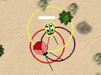

BugWorld / ALife V0.30a
=======================

This began as one of many 'artificial life' projects in a simple 2D world, where emergent behaviour can arise. But unlike many similar, the creatures (bugs) here do not rely entirely on evolution to improve their behaviour generation-by-generation but use *reinforcement learning* in order to learn useful behaviours by experiences within one generation.


There are plants, herbivores, predators, and rocks. The terrain is either sand, rock, or water. 

* Plants appear randomly across the maps at regular intervals.
* Herbivore bugs must seek out and eat the plants (simply by crawling over them to sap their energy)
* Predator bugs must seek out and eat the herbivore bugs (by running into them at a forward angle of attack to sap their energy)
* Both kinds of bugs bump into rocks at a cost to their energy
* Rock terrain cannot be crawled over; only flown over
* Bugs will drown if in the water for too long, but can fly over it
* Bugs die when their energy runs out
* Bugs spawn offspring if their energy goes above a certain level

Herbivore and predator bugs are animate agents, where input is in the form of three proximity sensors (two on each antennae plus the body as a third sensor) of three values each (representing RGB intensity) plus a value for the current energy level. All range between 0 and 1. Two output actions indicate angle and speed. 

### Input

Under the bugs' 'vision', predators are red, herbivores are blue, plants are green, rock and water is white (this does not correspond exactly to the graphics overlay). Each of the sensors varies from 0 to 1 representing the intensity of each color in the field of vision. Maximum values without touching is 0.9. A tenth input is the current energy level (also normalized between 0 and 1).

This is illustrated in the following examples. Note that the colours get brighter and duller dependending on proximity, and mix when more than one object is in the detection range (shown by the circles) for a particular sensor. The white bar represents the energy level.


<!--  -->


<!--  -->



### Output

The two dimensional output output is 1) change in angle in radians (e.g., -$\pi/4$ for a 45-degree left turn), and the speed ranges from -10 pixels/step in reverse to +10 moving forward. At values above +5, the bugs take flight and do not collide with anything (including rocks, water, and plants they need to eat). 

### Reward 

The reward is the energy level difference with the previous time step. Energy is burned constantly according to size, and thus in the absense of eating there is a constant negative reward. Energy is also lost proportionally to the speed of movement and change of angle, collisions with rocks and other bugs, and -- in particular -- when a herbivore bug is attacked by a predator bug. After a certain level, a creature automatically spawns a copy of itself, but this does not affect the reward.


Requirements
------------
	
* pygame - http://pygame.org/ - provides the graphics
* numpy - http://www.numpy.org/ - provides nice vector representations for vector algebra

Getting Started
---------------

If you have all the requirements, then run, for example,

```
	python ALife.py dat/maps/map_islands2.dat 5
```

to load with the map from the file `map_islands2.dat` (optional). The map can be edited by hand in the text file. By default, an empty map is used (no terrain). The number indicates how many creatures are to be spawned on initialization; 0 is none, 8 is a lot.

No interaction is required. But you may select an agent by clicking on it and thus viewing info (sensors, health, etc.) Also, the following keys are available:

* <kbd>g</kbd> -	Toggle graphics (turn animation off for faster iterations)
* <kbd>d</kbd> -	Toggle grid 
* <kbd>r</kbd> -	Add a new 'plant' (under the mouse pointer)
* <kbd>h</kbd> -	Add a new 'herbivore' (under the mouse pointer)
* <kbd>p</kbd> -	Add a new 'predator' (under the mouse pointer)
* <kbd>k</kbd> -	Add a new 'rock' (under the mouse pointer)
* <kbd>s</kbd> -	Saving currently selected creature to disk ('./dat/dna/')
* <kbd>l</kbd> -	Load creatures currently saved on disk ('./dat/dna/')
* <kbd>&uarr;</kbd> - More energy input to the environment (more plant growth)
* <kbd>&darr;</kbd> - Less energy input to the environment (less plant growth)


Related Projects
----------------

Some related projects with some nice demos on YouTube:
 [1](https://www.youtube.com/watch?v=2kupe2ZKK58), 
 [2](https://www.youtube.com/watch?list=PLC9058E743A6155C1&v=1Jou4ggCFKQ), 
 [3](https://sites.google.com/site/scriptbotsevo/).


Notes on Graphics
-----------------

* Terrain obtained from from [Open Game Art](https://opengameart.org/users/chabull)
* Sprites (bugs) from [Open Clip Art](https://openclipart.org/tags/ladybug)
